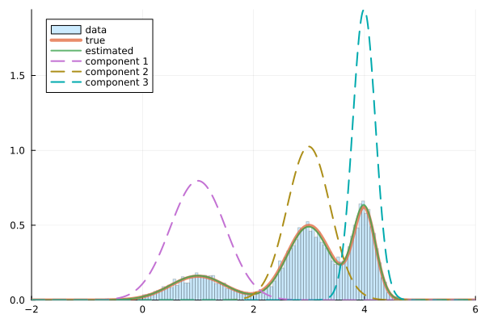

# Statistical-ml

[統計的機械学習 (杉山 将)](https://www.ohmsha.co.jp/book/9784274502484/) の演習問題の Julia 実装です。

## Contents

| 章 | 問題 | ファイル |
|:---|:---:|:---:|
| 4. 最尤推定法 | 4.3 | [ch04.jl](ch04.jl) |
| 5. 最尤推定法の理論的性質 | 5.2 | [ch05.jl](ch05.jl) |
| 6. 線形判別法による手書き文字認識 | 6.2 | [ch06.jl](ch06.jl) |
| 7. 最尤推定法におけるモデル選択 | 7.2 | [ch07.jl](ch07.jl) |
| 8. 混合ガウスモデルの最尤推定 | 8.3 | [ch08.jl](ch08.jl) |